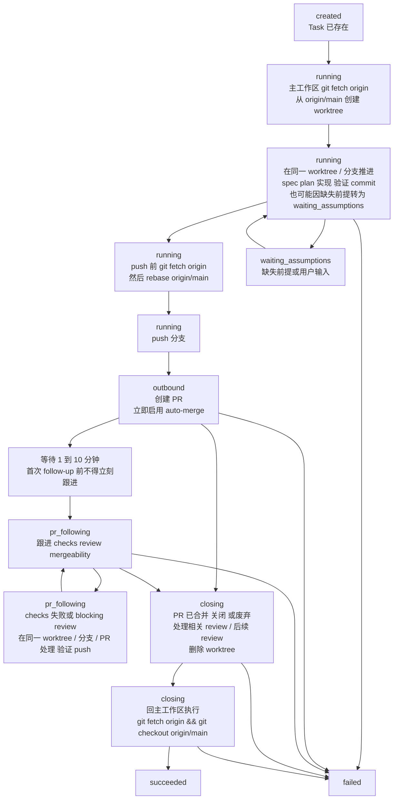

## 何时使用

当当前工作对应到一个已存在的 AIM Task，并且 agent 不仅要在生命周期事实发生时持续把这些事实同步回 AIM，还要把单个任务沿着 worktree、PR、follow-up 与 closing 阶段闭环推进时，使用此技能。

不要用此技能来创建任务、绕过仓库 `AGENTS.md`，或把 AIM 上报误当成可替代实际执行流程的编排器。

## 必需输入

- 已存在 AIM Task 记录的 `task_id`。如果缺失，必须停止，并暴露缺失的输入，而不是发送请求。
- 当前事实快照：包含当前生命周期状态，以及任何已知的 `worktree_path` / `pull_request_url` 值。

## 角色与边界

此技能描述的是“单个 AIM Task 的事实如何上报，以及该任务如何按仓库规则推进到真正完成”。它不改写仓库规则，只把这些规则映射到 AIM 生命周期状态。

- 主 Agent 只负责：读取用户要求、判定是否进入开发流程、派发 Sub Agent、审核结果、维护任务上下文，并且只在主工作区执行仓库准备操作与只读检查。
- 所有开发动作都必须由 Sub Agent 执行，包括 spec、implementation plan、代码、测试、验证、commit、push、PR、review 修复、merge 与清理动作。
- 主 Agent 不得因为任务小而绕过 Sub Agent；此技能也不提供这种例外。
- AIM 生命周期上报不会放宽任何 Git / worktree / PR 约束；如果仓库规则与惯性做法冲突，始终以 `AGENTS.md` 为准。

## 环境

- `SERVER_BASE_URL` 默认为 `http://localhost:8192`。
- 非终态生命周期更新使用 `PATCH ${SERVER_BASE_URL}/tasks/${task_id}`。
- 成功终态结果上报使用 `POST ${SERVER_BASE_URL}/tasks/${task_id}/resolve`。
- 失败终态结果上报使用 `POST ${SERVER_BASE_URL}/tasks/${task_id}/reject`。

## 生命周期状态

### 状态含义

- `created`：Task 已存在，但执行尚未开始。
- `waiting_assumptions`：执行因缺失前提假设或用户输入而阻塞。
- `running`：工作已经开始，且仍处于 worktree 内执行阶段；覆盖主工作区完成准备、worktree 创建、spec / implementation plan / 实现 / 验证 / commit / push 以及 PR 创建前的全部阶段。
- `outbound`：PR 已创建；如果 `pull_request_url` 已知则一并上报。此时已经出站，但还未进入首次正式 follow-up。
- `pr_following`：agent 已完成 PR 创建后的主动等待，并正在跟进 checks、reviews、mergeability 或 auto-merge 状态。
- `closing`：PR 已合并、关闭或确认废弃，任务进入收尾阶段；此阶段用于处理相关 review / 后续 review、清理 worktree，并刷新主工作区基线。
- `succeeded`：任务成功完成，并通过 `POST /resolve` 上报。
- `failed`：任务以失败终态结束，并通过 `POST /reject` 上报。

### 允许的状态流转

- `created -> running`
- `created -> waiting_assumptions`
- `running -> waiting_assumptions`
- `waiting_assumptions -> running`
- `running -> outbound`
- `running -> failed`
- `outbound -> pr_following`
- `outbound -> closing`
- `outbound -> failed`
- `pr_following -> pr_following`：当任务仍处于 PR 跟进阶段时，可用于重复的 follow-up 上报。
- `pr_following -> closing`
- `pr_following -> failed`
- `closing -> succeeded`
- `closing -> failed`

`running -> closing` 不是标准的 v1 路径，不应被写作正常状态流转。

终态写入一旦成功，不要再回退到非终态状态。
## 阶段映射

把仓库执行剧本映射到 AIM 生命周期时，使用下面的口径：

- `created`：Task 已存在，但主 Agent 还未开始派发或开发动作尚未真正开始。
- `running`：覆盖仓库剧本的准备阶段与产物编写阶段，也覆盖提交与出站阶段里“PR 创建之前”的动作。
  这一状态下可以持续补充 `worktree_path`，但不应因为 worktree 已创建就切换到其他状态。
- `outbound`：只表示 PR 已创建。若 `pull_request_url` 已知则立刻携带；若暂未拿到 URL，也不要因此拖延 `outbound` 上报。该状态是一个短暂阶段，用来表达“刚出站，尚未开始正式 follow-up”。
- `pr_following`：只在 PR 创建后完成一次有意等待后使用。等待窗口必须为 1 到 10 分钟，之后才进入 checks / review / mergeability / auto-merge 的持续跟进。
- `closing`：只在 PR 已合并、关闭或确认废弃后使用；此时仍未完成，直到相关 review / 后续 review 已处理完成、worktree 已删除且主工作区执行 `git fetch origin && git checkout origin/main` 刷新基线。
- `succeeded`：只有当 PR 终态成立、相关 review / 后续 review 已处理完成、worktree 已删除、主工作区基线已刷新，整个单 Task 闭环完成后才能上报。
- `failed`：当任务以失败终态结束时使用；不要把 AIM PATCH 失败误报成任务失败。

## 单 Task 推进流程



## 执行约束

单个 AIM Task 的实际推进必须和仓库规则保持一致：

- 开始开发任务前，主工作区必须先执行 `git fetch origin`，确保本地 `origin/main` 为最新状态。
- 开发动作只能基于 `origin/main` 在 `<repo>/.worktrees/` 下创建新的 worktree；禁止基于本地分支创建，也禁止在其他目录创建。
- 所有开发动作都必须在对应 worktree 中执行；主工作区只承载仓库准备操作、只读检查以及 closing 末尾的基线刷新。
- spec、implementation plan、代码、验证、commit、push、PR、review 修复、merge 与清理必须在同一 worktree、同一分支、同一 PR 内闭环推进，不得拆散。
- push 前必须在 worktree 中先执行 `git fetch origin`，再执行 `git rebase origin/main`；禁止跳过 rebase 直接 push。
- 所有代码合并必须通过 PR 完成，不得直接向 `main` 提交或推送。

## PR 跟进规则

- PR 创建后，必须立即尝试启用 auto-merge；如果因权限、仓库策略或平台状态无法启用，要把该阻塞视为真实事实继续跟进，而不是当作流程已完成。
- PR 创建后首次 follow-up 前，必须主动等待 1 到 10 分钟；`outbound` 正是这个等待窗口的状态表达。
- 进入 `pr_following` 后，必须持续跟进 checks、review、mergeability 与 auto-merge 状态；不要把“已开 PR”视为任务完成。
- 如果 checks 失败，先看失败详情。若原因仍在当前任务 scope 内，必须在同一 worktree、同一分支、同一 PR 中修复、验证、push，并继续跟进。
- 如果 checks 失败原因超出当前任务 scope，必须升级决策，不得擅自扩大范围。
- 如果存在 blocking review 或其他必须处理的 review 意见，必须在同一 worktree、同一分支、同一 PR 中继续处理、验证、push，并在阻塞解除前停止推进合并。
- 如果 review 意见与 spec、scope 或权限边界冲突，保持阻塞并升级决策。
- 如果存在 merge conflict、保护规则阻塞，或 auto-merge 尚未满足启用条件，任务仍停留在 `pr_following`；不要提前转入 `closing` 或终态。
- 当 checks 全部通过、没有 blocking review、没有 merge conflict、也没有保护规则阻塞时，应按仓库允许策略推动合并；不得等待用户手动点 merge，也不得绕过保护规则。

## 必须上报的时点

上报必须在生命周期过程中进行，不能拖延到只剩最终终态时才上报。

1. 执行开始时：上报 `running`。
2. worktree 创建后：在保持 `running` 的同时，上报已知的 `worktree_path`。
3. PR 创建后：上报 `outbound` 和 `pull_request_url`；如果此时 URL 暂未拿到，也不要因此拖延 `outbound` 上报。
4. 首次 follow-up 开始时：在完成 1 到 10 分钟的主动等待后，上报 `pr_following`，并保留已知的 `pull_request_url` / `worktree_path`。
5. PR 跟进期间：如有 checks 失败、blocking review、merge conflict、auto-merge 阻塞或其他新的阶段事实，继续以上报 `pr_following` 为主，并保留所有已知事实。
6. closing 期间：当 PR 已合并、关闭或确认废弃后，上报 `closing`，并保留所有已知事实；此阶段还要处理相关 review / 后续 review、删除 worktree，并刷新主工作区基线，因此尚未真正完成。
7. 成功时：只有在相关 review / 后续 review 已处理完成、worktree 已删除且主工作区基线已刷新后，才通过 `POST /tasks/${task_id}/resolve` 上报终态结果，并携带非空 `result`。
8. 失败时：通过 `POST /tasks/${task_id}/reject` 上报终态结果，并携带非空 `result`。

当任务因缺失前提假设或输入而被阻塞时，也要立即上报 `waiting_assumptions`。

## API 调用格式

非终态 PATCH 上报只使用受支持的局部更新字段：当生命周期阶段变化时再携带 `status`，并且只有在 `worktree_path` 和 `pull_request_url` 已知时才添加这两个字段。

终态结果上报不使用 PATCH。对 `succeeded` 使用 `POST /resolve`，对 `failed` 使用 `POST /reject`，并在请求体中只发送一个必填且非空的 `result` 字符串字段。

未知值不等于空字符串。对于未知字段，应省略，而不是发送 `""` 或伪造的 `null` 占位值。

第一个版本不要求支持清空字段的行为。

### Running 示例

```bash
curl -X PATCH "${SERVER_BASE_URL:-http://localhost:8192}/tasks/${task_id}" \
  -H "Content-Type: application/json" \
  --data '{
    "status": "running"
  }'
```

### Outbound 示例

```bash
curl -X PATCH "${SERVER_BASE_URL:-http://localhost:8192}/tasks/${task_id}" \
  -H "Content-Type: application/json" \
  --data '{
    "status": "outbound",
    "worktree_path": "/repo/.worktrees/task-123",
    "pull_request_url": "https://github.com/org/repo/pull/123"
  }'
```

### 终态成功示例

```bash
curl -X POST "${SERVER_BASE_URL:-http://localhost:8192}/tasks/${task_id}/resolve" \
  -H "Content-Type: application/json" \
  --data '{
    "result": "PR merged, worktree removed, and local baseline refreshed."
  }'
```

### 终态失败示例

```bash
curl -X POST "${SERVER_BASE_URL:-http://localhost:8192}/tasks/${task_id}/reject" \
  -H "Content-Type: application/json" \
  --data '{
    "result": "Spec assumptions no longer match the latest baseline and need replanning."
  }'
```

## 规则

- 只能使用 PATCH 来更新已存在 Task 的非终态事实。
- 只能使用 `POST /resolve` 上报 `succeeded` 终态结果，且只能使用 `POST /reject` 上报 `failed` 终态结果。
- 在非终态 PATCH 上报中，只发送受支持的 patch 字段，绝不要通过发送 `done` 来指挥 AIM。
- 终态上报的请求体必须且只能包含一个非空 `result` 字符串字段。
- 在后续非终态 PATCH 上报中，只要已知的 `worktree_path` 和 `pull_request_url` 仍然成立，就继续携带它们。
- 除非 PATCH 或终态 POST 实际成功，否则不要声称 AIM 已拥有最新事实。
- 这个技能是一种“上报纪律 + 生命周期映射”，不是授权主 Agent 直接执行开发动作的例外。

## 失败处理

要把任务失败与上报失败区分开。

- 任务失败：工作本身失败，因此应通过 `POST /tasks/${task_id}/reject` 发送带非空 `result` 的终态失败上报。
- 上报失败：PATCH 请求或终态 POST 因网络、超时、连接、5xx 或意外响应等问题失败。不要把这类情况转换成任务失败。

对于单个上报时点，最多只进行三次尝试：首次请求加最多两次重试。可以采用简短的重试模式，例如先等 1 秒，再等 5 秒。如果服务端返回明确的 4xx 输入错误，则停止重试，并暴露输入问题。

如果所有重试都失败，必须明确暴露 AIM 上报阻塞，并附带 task id、目标 URL、上报时点以及最终错误摘要。要说明业务事实已经发生，但 AIM 未被成功更新。重试耗尽后，不要声称该阶段已经同步。
