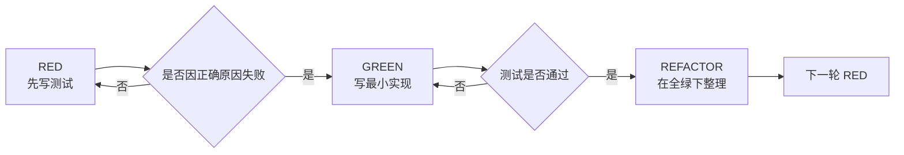

# aim-test-driven-development

## 概述

这个 skill 用于在 AIM 仓库内执行高压、不可稀释的测试驱动开发。

核心原则只有一句：**没有先看到针对目标行为缺口的真实失败，就不得写生产实现。**

这里的 TDD 不是“顺手补测试”，而是带顺序约束的执行纪律：`RED -> 观测失败 -> GREEN -> REFACTOR`。

违反字面规则，就是违反本 skill 的本意。不要用“我理解精神即可”给自己开例外。

## 何时使用

- 需要新增行为、修复缺陷、调整已有行为时。
- 需要补回归测试，防止同类问题再次出现时。
- 需要在实现前先把预期行为讲清楚，避免边写边猜时。
- 发现自己想先写实现、先手动点点看、或先保留一版参考实现时。

## 铁律

```text
没有失败中的测试，就没有生产代码。
没有看见正确原因的失败，就不算 RED。
```

必须同时满足以下条件，才算进入 GREEN：

1. 先写测试，再写实现。
2. 亲自运行该测试。
3. 亲自看到它失败。
4. 失败原因必须对应目标行为缺口，而不是拼写错误、环境损坏、夹具没建好、导入错误、测试本身写错。
5. 只有在上面四项都成立后，才能写最小实现。

## 硬规则

- 禁止先写实现，再补测试。
- 禁止把早写出来的实现保留为“参考”“草稿”“临时版本”。写早了就删除，再按 TDD 重来。
- 禁止测试从未失败过就把它当作保护网。没见过失败，说明你不知道它是否真能抓住缺口。
- 测试必须优先走真实代码路径、验证真实行为；除非确实无法避免，否则禁止用 mock 替代真实行为证据。
- 禁止把无关失败当成 RED 证据。报错位置和失败信息必须指向你要补的行为差距。
- 禁止在 GREEN 阶段顺手扩功能、补抽象、加配置、做泛化设计。
- 禁止用手工验证、截图、点点页面、临时脚本输出替代自动化测试。
- 禁止因为“代码很简单”“只是小改动”“时间紧”就跳过 RED。
- 禁止用“先探索一下实现更快”作为借口直接落生产代码。需要探索时，可以探索；探索产物不得作为正式实现保留。

## 标准循环



1. 写一个最小测试，只表达一个新增或修复的行为。
2. 运行测试，确认它为预期原因失败。
3. 只写让该测试通过所需的最小生产代码。
4. 再次运行测试，确认通过。
5. 运行受影响的相关测试，确认没有被带坏。
6. 仅在全绿后进入 REFACTOR。
7. 重复下一轮，而不是一次性把所有实现先写完。

## RED

RED 的目标不是“制造任何红色输出”，而是把目标行为缺口钉死。

要求：

- 测试名必须能说明行为，不要写成 `works`、`test1`、`handles case`。
- 每次只测一个行为差口；测试名里出现“并且”时，先怀疑是否应该拆分。
- 尽量用真实调用路径，不要用会掩盖真实行为的假断言。
- 如果现有代码已经通过该测试，说明你没有在测新的缺口；应重写测试或换下一个行为。
- 如果测试第一次运行就直接通过，这次 RED 失败了；不要把“直接绿了”解释成自己做对了。

合格 / 不合格示例：

合格：

```ts
test('retries failed operation 3 times', async () => {
  let attempts = 0
  const operation = async () => {
    attempts++
    if (attempts < 3) throw new Error('fail')
    return 'success'
  }

  await expect(retryOperation(operation)).resolves.toBe('success')
  expect(attempts).toBe(3)
})
```

不合格：

```ts
test('retry works', async () => {
  const fn = vi.fn()
    .mockRejectedValueOnce(new Error('fail'))
    .mockRejectedValueOnce(new Error('fail'))
    .mockResolvedValueOnce('success')

  await retryOperation(fn)
  expect(fn).toHaveBeenCalledTimes(3)
})
```

前者说明了行为和边界；后者名字含糊，且更像在测试 mock 编排是否配合自己，而不是测试真实意图。

## 观测失败

这是强制步骤，不能脑补，不能省略。

只有满足下面全部条件，RED 才完成：

- 测试实际执行了。
- 输出是失败，不是随便的运行时崩溃。
- 失败输出能对应预期行为差口。
- 失败原因是“功能还没实现 / 缺陷还没修复 / 行为还没改变”，而不是：
  - 拼写错误
  - 断言写反
  - 导入路径错
  - fixture 或 mock 坏了
  - 环境没起好
  - 测试文件本身无法运行

如果测试因为错误原因失败，RED 不成立。先修测试或修环境，再重新看到正确原因的失败。

简短示例：

```ts
test('empty email returns validation error', async () => {
  const result = await submitForm({ email: '' })
  expect(result.error).toBe('Email required')
})
```

合格的 RED 证据应类似：期望 `'Email required'`，实际得到 `undefined`。

不合格的 RED 证据应类似：`Cannot find module`、测试语法错误、数据库没连上。

## GREEN

GREEN 只做一件事：让刚才那个失败测试转绿。

要求：

- 只写最小实现。
- 只解决当前测试暴露的行为缺口。
- 不提前实现未来步骤。
- 不把“反正马上还要做”当作提前扩写的理由。
- 不引入与当前测试无关的新抽象、新参数、新配置、新分支。

合格 / 不合格示例：

合格：

```ts
function submitForm(data: { email?: string }) {
  if (!data.email?.trim()) return { error: 'Email required' }
  return { ok: true }
}
```

不合格：

```ts
function submitForm(
  data: { email?: string },
  options?: {
    trim?: boolean
    locale?: string
    validator?: (email: string) => boolean
  }
) {
  // 先把未来可能会用到的扩展点一起做掉
}
```

前者只让当前测试通过；后者把未来假设和泛化设计提前塞进了 GREEN。

如果你在 GREEN 阶段想做“更通用一点”“顺便整理架构”“先把后面几种情况都支持掉”，说明你已经偏离 TDD。

## REFACTOR

只有在当前测试和相关测试都为绿色时，才允许进入 REFACTOR。

REFACTOR 允许做的事：

- 去重复
- 改命名
- 提取局部辅助
- 简化结构

REFACTOR 不允许做的事：

- 偷偷新增行为
- 扩 scope
- 把未测试的新设计塞进来

重构后必须重新运行当前测试和受影响的相关测试，并且它们必须保持绿色。

一旦重构把测试改红，立即停下，先恢复绿色；在恢复全绿之前，不得继续推进。

## 卡住时怎么办

- 不知道怎么写测试：先写你期望存在的调用方式和断言，再倒推最小接口。
- 测试很难写 / 接口太复杂：先怀疑设计过重；优先缩小接口、减少分支、降低耦合。
- 必须 mock 很多东西：通常说明依赖缠得太紧；先拆依赖或引入更清晰的边界，不要把大量 mock 当常态。
- 测试 setup 太重：先提取最小测试辅助；如果还是很重，继续简化设计，而不是接受臃肿 setup。

## 常见借口 / 误判

| 借口或误判 | 正确处理 |
| --- | --- |
| 我先写实现更快，之后补测试一样 | 不一样。没先看到失败，就没有证明测试真能抓住缺口。 |
| 我已经手工验证过了 | 手工验证不能替代可重复、可回归的自动化测试。 |
| 这次改动太小，不值得走 RED | 小改动同样会引入回归；RED 的成本通常比回滚更低。 |
| 测试已经红了，原因先不管 | 不行。失败原因必须就是目标行为缺口。 |
| 我保留早写的实现当参考，不算正式实现 | 也不行。你会围着已有实现补测试，顺序已经被破坏。 |
| GREEN 多写一点更省事 | 这会把未被测试约束的设计带进生产代码。 |
| 手工点通了页面，再补断言即可 | 不可替代。页面点通只能说明这次碰巧工作，不代表可回归验证。 |

## 红旗

出现以下任一想法时，立即停下，回到 RED：

- “先把实现搭出来，测试等会儿写。”
- “测试已经红了，虽然不是这个原因，但差不多。”
- “这段早写的代码我先留着参考。”
- “刚才手工试过了，所以可以少写测试。”
- “这次顺手把未来需求一起做了。”
- “测试直接通过也没关系，说明我写对了。”
- “我知道它会失败，不跑也行。”

这些都不是效率，而是绕过纪律。

## 验证清单

- [ ] 每个新增或修复的行为，先有测试。
- [ ] 每个测试都先被实际运行过。
- [ ] 每个测试都先因正确原因失败过。
- [ ] 没有把无关失败误当 RED。
- [ ] 没有在测试之前保留或复用实现。
- [ ] GREEN 阶段只写了最小实现。
- [ ] 当前测试通过。
- [ ] 受影响的相关测试通过。
- [ ] REFACTOR 只发生在全绿之后。
- [ ] 没有用手工验证替代自动化测试。

有任一项无法勾选，就不要声称自己做了 TDD。
